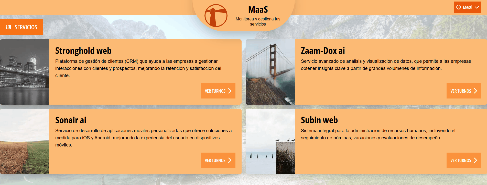
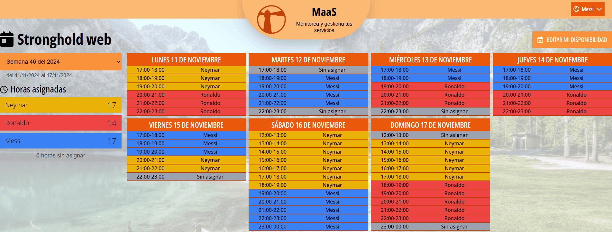
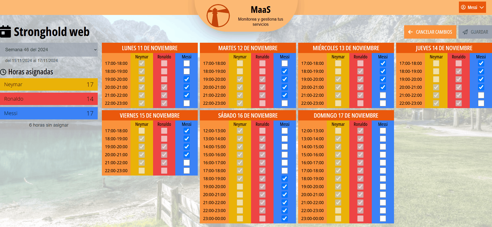

# MaaS (Monitoring as a Service) Frontend App

Web application developed with Vue 3, Pinia and TypeScript. This application is responsible for managing the API of the platform and displaying the available services and the assigned shifts to the users. The internals of the business logic and shifts scheduling algorithm are implemented in the [maas_backend](https://github.com/joselagos/maas_backend) repository.

## Features

### Service overview

Shows the available services to the users. The user can select a service and view its details, including the up to date assigned shifts.



### Show service

Displays the selected service along with the weekly schedule of assigned shifts. Users have access to the final shifts of the previous weeks, expected to be generated on each employee's available hours. They can edit their availability for the current week and up to five weeks ahead but cannot modify their availability for past weeks.

Additionally, this screen shows the hours count for each registered user in the service alongside the total number of remaining hours to be filled. In the event that there are hours left, it's expected for the employees to fill the remaining gaps.



### Edit service availability

Allows users to edit their available hours for the selected week while viewing the availability of other users in the same service. Changes are saved by clicking the "Save" button, which prompts a confirmation dialog. Once confirmed, the backend shift scheduler algorithm is executed, generating updated shifts for the specified service week.



## Tech Stack

- Vue 3
- Pinia
- TypeScript
- Vitest
- Tailwind CSS

## Getting Started

To set up the development environment, the following steps need to be followed:

1. Clone the repository:

```
git clone https://github.com/joselagos/maas_frontend.git
```

2. Install the development dependencies:

```
npm install
```

3. To run the development server, run the following command:

```
npm run dev
```

## Users

Currently the system has three test users, which have access to the four services enabled for shift assignment. They are generated by the seeds.rb file located in the db folder of the [maas_backend](https://github.com/joselagos/maas_backend) repository, therefore it's required to run the seeds and migrations before running the application.

The users are the following:

### Admins

```
  Username: pepe@maas.com
  Password: contrasena_admin
```

### Users

```
  Username: messi@maas.com
  Password: contrasena
```

```
  Username: cristiano@maas.com
  Password: contrasena
```

```
  Username: neymar@maas.com
  Password: contrasena
```

## Tests

This project was designed following the Test Driven Development (TDD) pattern, so each feature has its respective test file in the \_\_tests\_\_ folder. The unit and component tests were implemented using [Vitest](https://vitest.dev/). To run the tests, run the following command:

```
npm run test:unit
```
